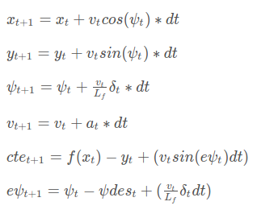

# Model Predictive Control (MPC) for a Simulated Car

A model predictive control is used to control the steering and throttle for a simulated car driving around a race track. A kinematic model is used to predict the state (position (x,y), heading(psi), velocity(v)). Steering and throttle control outputs are used to get the car to follow a reference trajectory along the road.

In order to follow the reference trajectory closely, we need to minimize the cross track error (cte) and the orientation error (epsi). The change of these vectors over time is captured in the kinematic model by augmenting these errors in the state vector. The new state vector has 6 variables [x,y,psi,v,cte,epsi]. The control outputs are throttle (represented by acceleration a) and steering angle (delta)

---
## Vehicle model

A kinematic model is used to predict how this augmented state evolves over time.




The predicted state is compared with the reference trajectory that we are trying to follow and the error between the reference trajectory and predicted trajectory should be minimized over time. At each time step, the steering angle and throttle command that minimize this error over time is determined. This is basically how the vehicle model is used to implement the MPC algorithm.

---

## Timestep Length and Elapsed Duration (N & dt)

N and dt determines the length of time over which the optimizer (Ipopt solver) mimimizes the error between the reference trajectory and the predicted trajectory.

Have a large value for length of time (= N*dt) can take a take the optimizer a long time to converge on a solution.

More importantly, it influences the driving behavior at various speeds. N*dt determines the "Lookahead distance" or how far out we are looking to determine our current control outputs. If the lookahead distance is too large, then we are reacting too early to curves and could make our driving unstable on curves. If the lookahead is small, then we could get unstable on a straight road. N of 10 and dt of 0.1 seemed to work well for the 50mph speed that I tuned the various values for. But these would not work for higher speeds

The "Lookahead distance" is a function of velocity and so the time for which we minimize errors for needs to be a function of velocity.

When I tried N=20, and dt = 0.1 it would be unstable on curves. When I tried N = 5, dt = 0.1, the car is a little "jumpy" on staights. N = 10 and dt = 0.1 seems to work well for a reference velocity of 50mph.

---
## Polynomial fitting and MPC Preprocessing

A 3rd order polynomial is used to fit the waypoints

The waypoints are first transformed into the car frame. This is done because it is easier to compute the cte and epsi in the car frame. Also, if the reference trajectory lay more along the global y axis, we could end up with an ill fitted polynomial. Transforming into car coordinates solves both these problems.

Initially used a transformation matrix from global to vehicle frame (see commented out lines 129-142) to do the transformation. But computing the inverse in real time could be expensive and so ended up using the expanded form (see lines 143 - 151).

---
## Model predictive control with latency

Latency plays a major role in coming up with a set of values in the cost function that allows the car to smoothly drive the loop

Commenting out the 100ms delay that was being added, allowed coming up with a set of cost function values that worked well quite easily. But the latency has to be taken into account for the final implementation!

This was by done determining the initial state that is fed into the MPC algorithm using a modeled latency and the vehicle model. This is implemented in lines 189-200 of main.cpp. The inital state is shifted in time because of the latency before being fed into the MPC algorithm.

Even though the deliberate latency being introduced is 100ms, I found that using a modeled latency of 200ms allows for a much smoother drive. Could this be because a larger latency is being introduced on my system?

---

## Additional considerations

I also had to allow for a higher cpu time (=50 rather than default value of 0.5) to get the ipopt not to return zero cost while the car is driving.

Needed a high value for to minimize the steering actuator values, which was surprising

---

## Results and discussions

The car smoothly drives the loop multiple times at a speed of 50mph. The car remains in the center of the road for the most part.

In order to be able to drive at any reference velocity a dynamic lookahead, where N and dt are a function of velocity may have to be introduced.

---

## Dependencies

* cmake >= 3.5
 * All OSes: [click here for installation instructions](https://cmake.org/install/)
* make >= 4.1(mac, linux), 3.81(Windows)
  * Linux: make is installed by default on most Linux distros
  * Mac: [install Xcode command line tools to get make](https://developer.apple.com/xcode/features/)
  * Windows: [Click here for installation instructions](http://gnuwin32.sourceforge.net/packages/make.htm)
* gcc/g++ >= 5.4
  * Linux: gcc / g++ is installed by default on most Linux distros
  * Mac: same deal as make - [install Xcode command line tools]((https://developer.apple.com/xcode/features/)
  * Windows: recommend using [MinGW](http://www.mingw.org/)
* [uWebSockets](https://github.com/uWebSockets/uWebSockets)
  * Run either `install-mac.sh` or `install-ubuntu.sh`.
  * If you install from source, checkout to commit `e94b6e1`, i.e.
    ```
    git clone https://github.com/uWebSockets/uWebSockets
    cd uWebSockets
    git checkout e94b6e1
    ```
    Some function signatures have changed in v0.14.x. See [this PR](https://github.com/udacity/CarND-MPC-Project/pull/3) for more details.

* **Ipopt and CppAD:** Please refer to [this document](https://github.com/udacity/CarND-MPC-Project/blob/master/install_Ipopt_CppAD.md) for installation instructions.
* [Eigen](http://eigen.tuxfamily.org/index.php?title=Main_Page). This is already part of the repo so you shouldn't have to worry about it.
* Simulator. You can download these from the [releases tab](https://github.com/udacity/self-driving-car-sim/releases).
* Not a dependency but read the [DATA.md](./DATA.md) for a description of the data sent back from the simulator.


## Basic Build Instructions

1. Clone this repo.
2. Make a build directory: `mkdir build && cd build`
3. Compile: `cmake .. && make`
4. Run it: `./mpc`.
